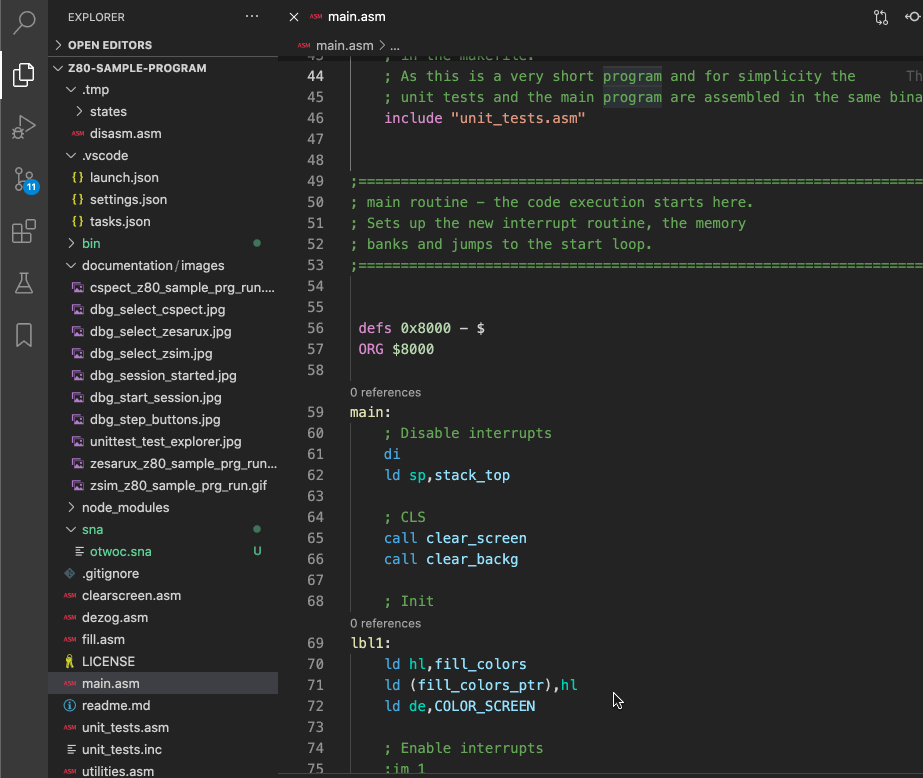
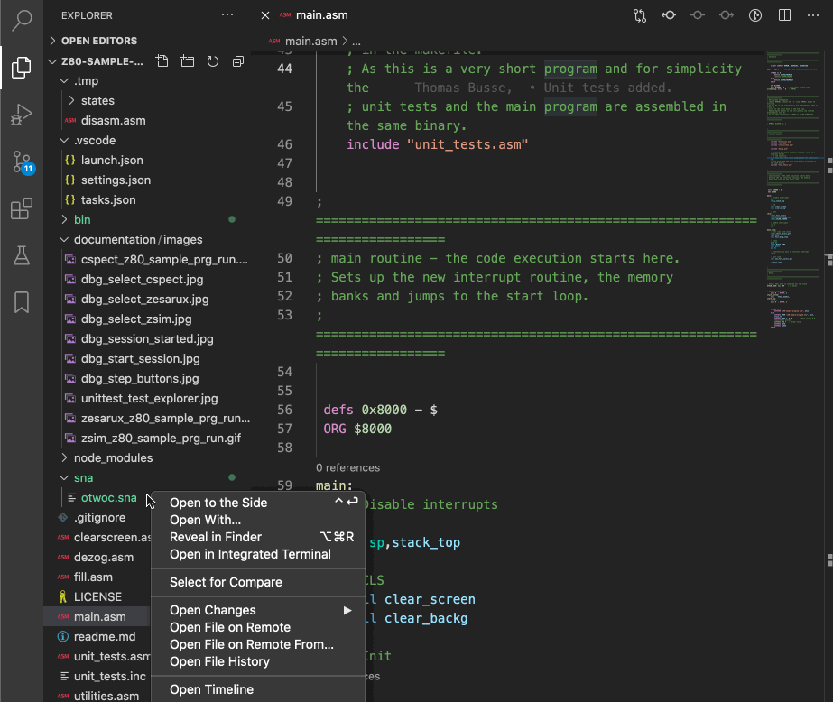
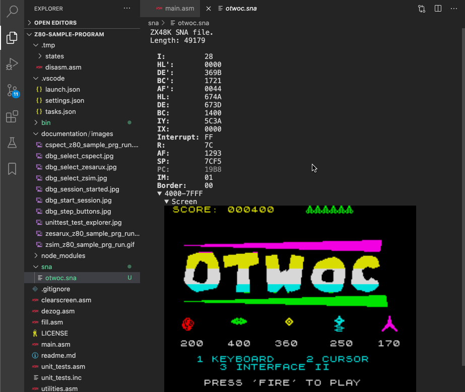

# Support

If you like the "ZX SNA File Viewer" please consider supporting it.

&nbsp;&nbsp;

# ZX SNA File Viewer

This extension adds a readonly file viewer for ZX Spectrum SNA, snapshot files.
It shows registers, a memory dump and the included ZX screen.
It can read 48K and 128K SNA files.

The SNA file format specification can be found [here](https://worldofspectrum.org/faq/reference/formats.htm).

## Installation

Install through Visual Studio Code Marketplace.
The extension is called "ZX SNA File Viewer".

# Usage

Just click on a file with the *.sna extension.
The file is opened and shown in the text editor area.

Alternatively you can open a SNA file via "Open With...":

When hovering over a value or register name you will get additional info like the offset or the value in decimal:

